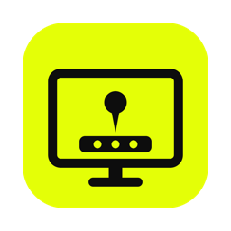

<p align="center">
  
</p>

<h1 align="center">DockPin</h1>

<p align="center">
  Keeps the macOS Dock on your main display, whatever your display arrangement.<br>
  Developed by <strong>Nicolas Boada</strong> at <a href="https://talkk.com.au"><strong>TALKK Web &amp; App Studio</strong></a>.
</p>

<p align="center">
  <a href="https://github.com/nboada/DockPin/releases/latest"><strong>Download the latest version</strong></a>
</p>

---

## Why

With more than one display, macOS moves the Dock to whichever screen you
push the cursor against the bottom edge of. Brush the bottom of your laptop
screen and the Dock jumps there, away from the big monitor where you want it.
There is no setting to turn that off.

DockPin is a small menu bar app that stops that from happening and moves the
Dock back if it ever ends up on the wrong screen.

## Install

1. Download `DockPin-<version>.dmg` from the
   [latest release](https://github.com/nboada/DockPin/releases/latest).
2. Open it and drag **DockPin** into **Applications**.
3. Launch DockPin. macOS asks for **Accessibility** permission: open
   System Settings > Privacy & Security > Accessibility and turn DockPin on.
   DockPin needs this to watch and guide the cursor.
4. The menu bar icon goes from dimmed to solid once DockPin is active.
   Tick **Launch at Login** in its menu so it is always running.

DockPin is signed with a Developer ID and notarized by Apple.

**Requirements:** macOS 13 Ventura or later, Apple silicon or Intel.

## How it works

- Your **main display** is the one with the white menu bar in
  System Settings > Displays > Arrange. Drag that bar to change which display
  DockPin treats as main.
- On every other display, DockPin stops the cursor a few points above the
  bottom edge, so the Dock never gets the signal to move there. Edges with
  another display directly below are left alone, so you can still move the
  cursor between screens.
- On launch, after waking from sleep and whenever displays change, DockPin
  checks where the Dock is. If it is on the wrong display, DockPin briefly
  pushes the cursor against the bottom of the main display, which brings the
  Dock back, then returns the cursor to where it was.
- DockPin does nothing while the Dock is positioned on the left or right.

The menu bar icon shows the current status and has **Move Dock to Main Display
Now**, **Pause**, **Launch at Login** and **About**.

## Troubleshooting

- **The icon stays dimmed.** Accessibility permission is missing. Open the
  menu and choose *Open Accessibility Settings…*, then turn DockPin on. If it is
  already on, remove it with the minus button, add it again, and relaunch.
- **The Dock does not move back.** Automatic moves only work if part of the
  main display's bottom edge has no other display below it.
- **Logs.** DockPin writes what it does to `~/Library/Logs/DockPin.log`.

## Build from source

Needs the Xcode Command Line Tools (`xcode-select --install`).

```bash
git clone https://github.com/nboada/DockPin.git
cd DockPin
./build.sh install     # build, copy to /Applications and launch
```

`./build.sh` alone builds into `build/`. Local builds are signed with your
Apple Development certificate when one is installed, so the Accessibility
grant survives rebuilds. Otherwise they are ad hoc signed, and after each
rebuild you need to remove and re-add DockPin in the Accessibility list.

### Releasing

`./build.sh release` builds a universal app, signs it with a Developer ID
Application certificate, notarizes it and writes `dist/DockPin-<version>.dmg`.
One-time setup:

```bash
xcrun notarytool store-credentials dockpin-notary \
  --apple-id <your-apple-id> --team-id <your-team-id>
```

Bump `CFBundleShortVersionString` and `CFBundleVersion` in `Info.plist` for
each release. `DOCKPIN_SIGN_IDENTITY` and `DOCKPIN_NOTARY_PROFILE` override the
certificate and keychain profile. Without a Developer ID certificate the script
still builds an unnotarized DMG.

The icon is drawn by `tools/make-icon.swift`:

```bash
swift tools/make-icon.swift . && iconutil -c icns build/AppIcon.iconset -o Resources/AppIcon.icns
```

## Credits

Designed and developed by **Nicolas Boada** at
**[TALKK Web & App Studio](https://talkk.com.au)**, Byron Bay, Australia.

## License

[MIT](LICENSE) © 2026 Nicolas Boada, TALKK Web & App Studio
